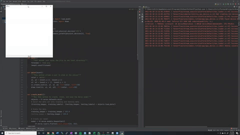

# Keras-Handwritten-Digit-App
In this project, you can draw a digit with your mouse and Keras will tell you what the number is you drew. 

## Instructions

1. Download the main.py and my_model.h5  
2. Run main.py  
3. When the tkinker canvas opens, write the number (0-9) in the canvas, save the canvas (button on bottom), close the canvas, and look at the terminal for your number. 
